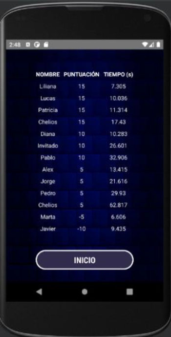

# Quiz Labs - Aplicación Android

## Descripción

**Quiz Labs** es una aplicación desarrollada en **Android Studio** que ofrece una experiencia divertida y educativa a través de un juego de preguntas y respuestas de cultura general. Esta app no solo permite medir tus conocimientos, sino que también te ofrece varias funcionalidades adicionales, como la creación, modificación y eliminación de preguntas, así como la posibilidad de buscar una pregunta específica en la base de datos.

### Características principales:
- **Juego de preguntas**: Responde preguntas de cultura general, y obtén una puntuación basada en tus aciertos y el tiempo que tardas en responder.
- **Crear y modificar preguntas**: Los usuarios pueden agregar, eliminar o modificar preguntas en la base de datos.
- **Ranking**: Se lleva un ranking de jugadores ordenado por puntuación. En caso de empate, el tiempo se usa para desempatar.
- **Ayuda**: Una sección de ayuda donde los usuarios pueden consultar las reglas del juego.
- **Animaciones y sonidos**: La aplicación ofrece una experiencia envolvente gracias a sus animaciones, transiciones entre pantallas y música.

## Estructura del proyecto

### Pantallas y funcionalidades:

1. **Pantalla de Inicio**:
   - El jugador introduce su nombre para empezar el juego.
   - Acceso a la barra de navegación lateral con opciones de Ranking, Base de Datos y Ayuda.
  
2. **Pantalla de Preguntas**:
   - Se presentan las preguntas una a una. El jugador responde y el juego indica si la respuesta es correcta o incorrecta.
   - Al finalizar, se calcula el tiempo empleado y la puntuación.

3. **Pantalla de Fin de Juego**:
   - Muestra la puntuación obtenida y opciones para ver el ranking o regresar al inicio.

4. **Pantalla de Ranking**:
   - Muestra una lista de jugadores ordenada por puntuación y, en caso de empate, por tiempo.

5. **Pantalla de Base de Datos de Preguntas**:
   - Funcionalidades para agregar, buscar, modificar y eliminar preguntas.

6. **Pantalla de Ayuda**:
   - Información sobre cómo jugar y usar la aplicación.

### Clases principales:

- **MainActivity**: Maneja la pantalla principal, la configuración del navigation drawer y el inicio del juego.
- **GameActivity**: Controla la lógica del juego, como la gestión de las preguntas, el tiempo y la puntuación.
- **GameOverActivity**: Muestra la puntuación final y permite al jugador ver el ranking o regresar al inicio.
- **QuestionsActivity**: Gestiona las operaciones sobre la base de datos de preguntas (crear, buscar, modificar y eliminar).
- **RankingActivity**: Muestra el ranking de jugadores ordenado por puntuación.
- **AdminSQLiteOpenHelper**: Clase encargada de gestionar la base de datos SQLite.
- **MusicPlayerManager**: Controla la música y sonidos dentro de la aplicación.

## Requisitos

- **Android Studio**: Para abrir y ejecutar el proyecto.
- **Emulador o Dispositivo Android**: Para probar la aplicación en un dispositivo físico o virtual.
- **Base de Datos SQLite**: Para gestionar las preguntas y el ranking de los jugadores.

# Instalación

1. Clona el repositorio:
   ```bash
   git clone https://github.com/tu_usuario/quiz-labs.git
   
2. Abre el proyecto en Android Studio.

3. Asegúrate de tener configurado un dispositivo o un emulador para probar la aplicación.

4. Ejecuta la aplicación en el emulador o dispositivo Android.

# Autores

https://github.com/a-sisla

https://github.com/a-martinma

# Imágenes

<div style="display: flex; gap: 20px;">
  
  
  
  
</div>


